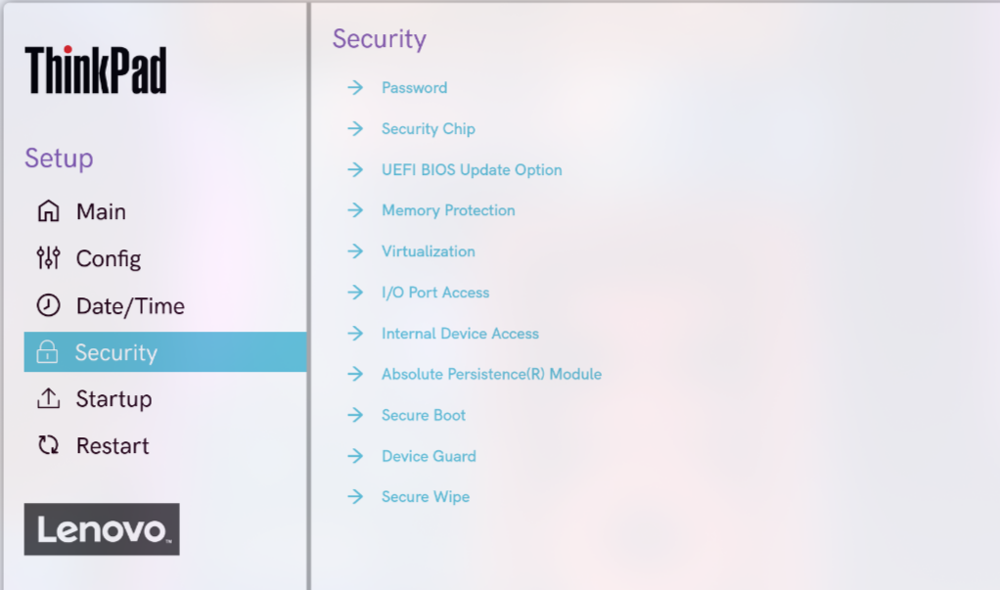
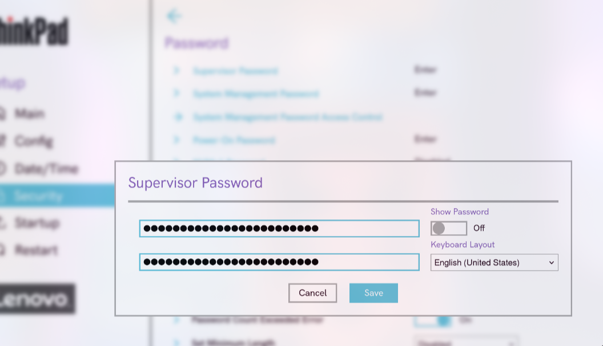

author: Carlos Alcina Romero
summary: bios-uefi
id: bios-uefi
categories: codelab,markdown
environments: Web
status: Published
feedback link: [https://github.com/alcinacarlos?tab=repositories](https://github.com/alcinacarlos?tab=repositories)

# Parte 1: Guía para Bastionar la BIOS/UEFI

Este codelab explica cómo reforzar la seguridad de la BIOS/UEFI de un equipo para protegerlo de accesos no autorizados y manipulación de hardware antes del arranque del sistema operativo.

## Contraseña de usuario o Power-On

**Objetivo:** Evitar el acceso no autorizado al equipo antes de que arranque el sistema operativo.

### Pasos

1. Reinicia el ordenador y accede al menú BIOS/UEFI (usualmente presionando **Supr, F2, Esc o F10** según el fabricante).

   

2. Dirígete al apartado **Security** o **Seguridad**.

   

3. Busca la opción **User Password**, **Power-On Password** o similar.

   

4. Introduce una contraseña segura que combine letras, números y símbolos.

5. Guarda los cambios y reinicia el sistema.

   

**Resultado:** El sistema pedirá una contraseña antes de iniciar el arranque.

---

## Contraseña de administrador

**Objetivo:** Restringir el acceso y las modificaciones a la configuración de la BIOS/UEFI.

### Pasos

1. Ingresa nuevamente al menú BIOS/UEFI.

2. En la sección **Security**, selecciona **Administrator Password** o **Supervisor Password**.

   

3. Guarda los cambios y reinicia el equipo.

   

**Resultado:** Solo quien conozca la contraseña de administrador podrá modificar la configuración del BIOS/UEFI.

---

## Arranques externos

**Objetivo:** Evitar que el sistema se inicie desde dispositivos externos (USB, DVD, etc.) que puedan contener software malicioso.

### Pasos

1. Accede al BIOS/UEFI.

2. Busca la sección **Boot**, **Boot Options** o **Advanced Boot Options**.

   

3. Desactiva **Boot Device List F12 Option** y **Boot Order Lock**.

4. Guarda los cambios.

   

**Resultado:** El equipo no podrá arrancar desde medios externos sin autorización.

---

## Orden de arranque

**Objetivo:** Asegurar que el sistema operativo principal sea el primero en arrancar y evitar manipulaciones.

### Pasos

1. Entra al BIOS/UEFI y localiza la pestaña **Boot**.

2. Establece como primera opción de arranque el disco donde está instalado el sistema operativo.

   

3. Mueve cualquier otro dispositivo (USB, CD/DVD, red, etc.) fuera de la lista.

4. Guarda los cambios.

   

**Resultado:** El sistema solo iniciará desde el disco autorizado.

---

## Otras opciones de seguridad

**Objetivo:** Aplicar configuraciones adicionales que fortalezcan la seguridad general del BIOS/UEFI.

### Recomendaciones

* **Activar Secure Boot:** Garantiza que solo se carguen sistemas operativos y controladores firmados digitalmente.

  
  

* **Desactivar puertos innecesarios:** Esto minimiza posibles vectores de ataque.

  
  

* **Habilitar TPM (Trusted Platform Module):** Permite cifrado de disco (BitLocker, LUKS), autenticación avanzada como Windows Hello y arranque seguro.

  
  

**Resultado:** La BIOS/UEFI estará reforzada contra accesos no autorizados y manipulación del arranque.

