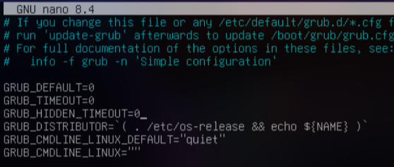
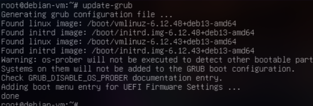
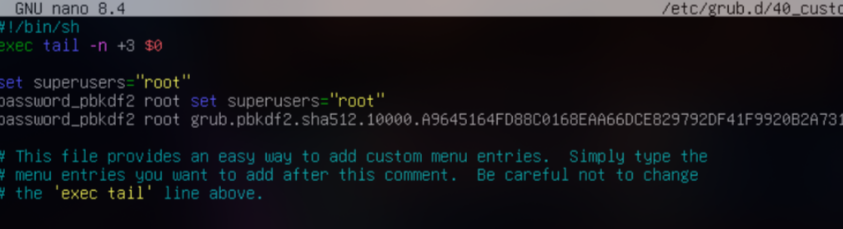
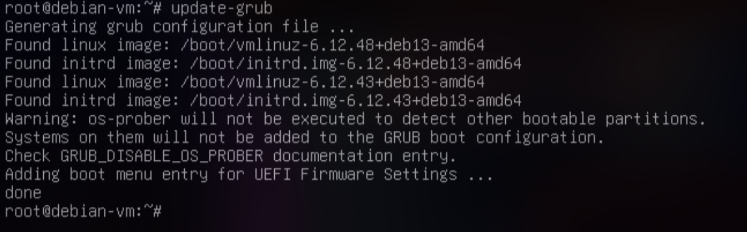
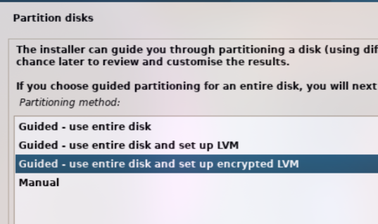
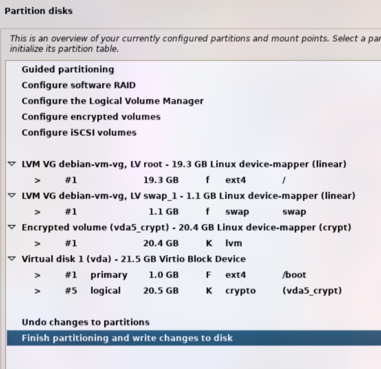
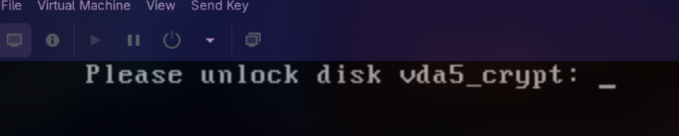

author: Carlos Alcina Romero
summary: grub-debian
id: grub-debian
categories: codelab,markdown
environments: Web
status: Published
feedback link: [https://github.com/alcinacarlos?tab=repositories](https://github.com/alcinacarlos?tab=repositories)

# Proyecto 1 – Parte 2: Bastionado del arranque de Debian

## Introducción

En esta guía aprenderás a proteger el arranque de un sistema Debian para impedir que un actor malicioso pueda modificarlo y acceder al sistema sin autorización.

Se cubrirán los siguientes puntos:

* Ocultación del menú de arranque.
* Configuración de contraseña en GRUB2.
* Copias de seguridad de la configuración del arranque.
* Otras medidas de seguridad opcionales.


---

## 1. Ocultación del menú de arranque (GRUB2)

1. Abrir el archivo de configuración principal de GRUB:

```bash
sudo nano /etc/default/grub
```

2. Modificar los siguientes parámetros:

```text
GRUB_TIMEOUT=0        # Reduce el tiempo de espera a 0 segundos
GRUB_HIDDEN_TIMEOUT=0 # Oculta el menú
```

3. Guardar los cambios y regenerar la configuración de GRUB:




```bash
sudo update-grub
```



> Esto asegura que los usuarios no vean el menú de arranque y evita intentos de manipulación del kernel o selección de otros sistemas operativos.


---

## 2. Configuración de contraseña en GRUB2

1. Crear una contraseña cifrada para GRUB2:

```bash
sudo grub-mkpasswd-pbkdf2
```

* Introduce la contraseña deseada.
* Copia la salida que empieza con `pbkdf2`.

2. Editar el archivo `/etc/grub.d/40_custom`:

```bash
sudo nano /etc/grub.d/40_custom
```

3. Agregar las siguientes líneas al final del archivo (reemplaza `HASH_GENERADO` por tu valor generado):

```text
set superusers="root"
password_pbkdf2 root HASH_GENERADO
```


4. Cambiar permisos para proteger el archivo:

```bash
sudo chmod 700 /etc/grub.d/40_custom
```


5. Regenerar la configuración de GRUB:

```bash
sudo update-grub
```


> Ahora, cualquier modificación del menú de arranque o entrada de kernel requerirá la contraseña configurada.


---

## 3. Copia de seguridad de la configuración de GRUB2

Es importante mantener una copia de seguridad de los archivos de configuración por si se realizan cambios erróneos.

```bash
sudo cp /boot/grub/grub.cfg /boot/grub/grub.cfg.bak
sudo cp -r /etc/grub.d /etc/grub.d.bak
sudo cp /etc/default/grub /etc/default/grub.bak
```

> Estas copias permiten restaurar la configuración original si algo sale mal durante la configuración.


---

## 4. Otras opciones de seguridad: Instalación de Debian con cifrado de disco LVM

Para proteger completamente los datos en caso de acceso físico no autorizado, se recomienda instalar Debian usando LVM con cifrado completo de disco.

### Pasos de instalación:

1. Arranca desde el medio de instalación de Debian.

2. Selecciona el idioma y la configuración de red.

3. En la sección de particionado, elige:

   * **"Guiado - usar disco entero y configurar LVM con cifrado"**



4. Selecciona el disco que deseas cifrar y sus particiones.


5. Marca la opción **"Cifrar la partición de volumen lógico con contraseña"**.

6. Ingresa una contraseña fuerte para el cifrado de disco.


7. Finaliza la instalación y reinicia.



> Al iniciar el sistema, se te solicitará la contraseña del cifrado antes de que GRUB arranque el sistema operativo.


---

## 5. Resumen y buenas prácticas

* GRUB protegido con contraseña y oculto mejora significativamente la seguridad del arranque.
* Copias de seguridad y permisos correctos evitan pérdidas por errores de configuración.
* Combinado con cifrado de disco y controles de BIOS/UEFI se obtiene un arranque robusto frente a accesos no autorizados.

---

## Referencias

* [Documentación oficial de GRUB2](https://www.gnu.org/software/grub/manual/grub/grub.html)
* [Guía de cifrado en Debian](https://wiki.debian.org/DiskEncryption)