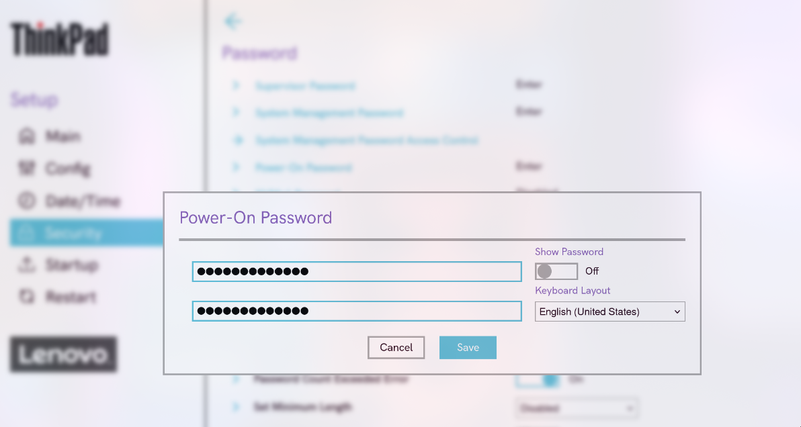
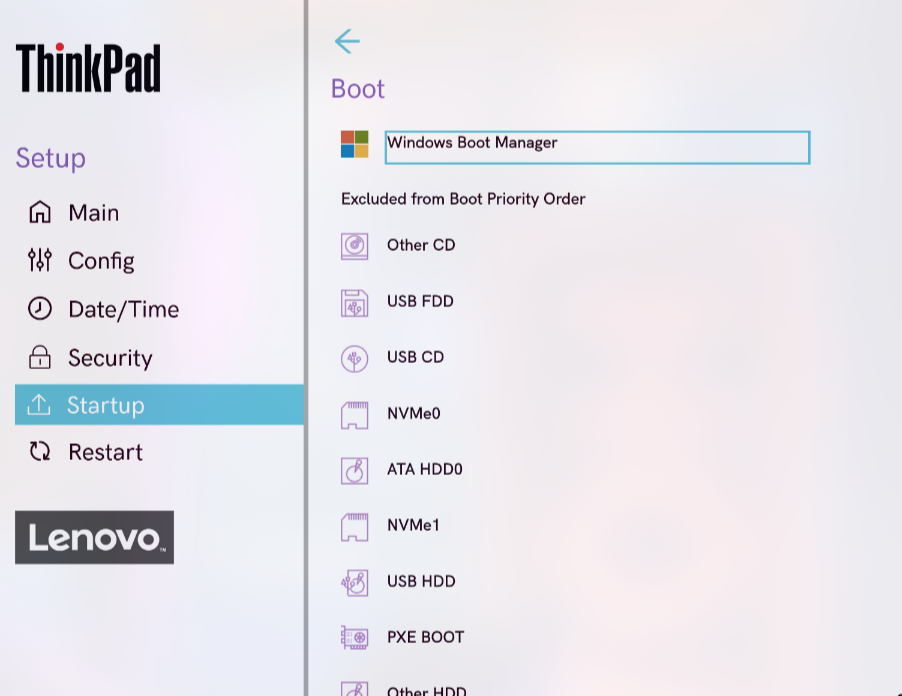
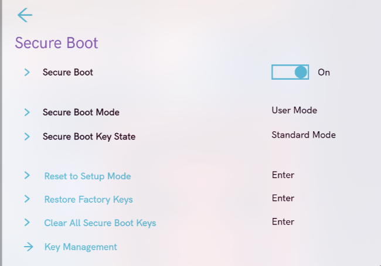
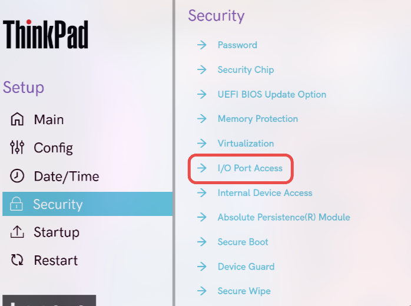
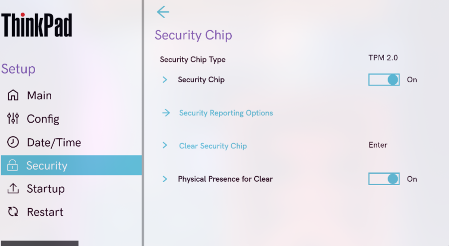

author: Carlos Alcina Romero
summary: Proyecto1
id: Proyecto1
categories: codelab,markdown
environments: Web
status: Published
feedback link: https://github.com/alcinacarlos?tab=repositories

# Proyecto 1

## Parte 1: Guía para Bastionar la BIOS/UEFI

### 1.1. Contraseña de usuario o Power-On

El objetivo es evitar el acceso no autorizado al equipo antes del arranque del sistema operativo.

#### Pasos

Reinicia el ordenador y accede al menú BIOS/UEFI (usualmente presionando Supr, F2, Esc o F10 según el fabricante).

Dirígete al apartado Security o Seguridad.

Busca la opción User Password, Power-On Password o similar.

Introduce una contraseña segura que combine letras, números y símbolos.

Guarda los cambios y reinicia el sistema.

El sistema pedirá una contraseña antes de iniciar el arranque.

### 1.2. Contraseña de administrador

El objetivo es restringir el acceso y las modificaciones a la configuración de la BIOS/UEFI.

#### Pasos

Ingresa nuevamente al menú BIOS/UEFI.

En la sección Security, selecciona Administrator Password o Supervisor Password.

Guarda los cambios y reinicia el equipo.

Solo quien conozca la contraseña de administrador podrá modificar la configuración del BIOS/UEFI.

### 1.3. Arranques externos

El objetivo es vitar que el sistema se inicie desde dispositivos externos (USB, DVD, etc.) que puedan contener software malicioso.

#### Pasos

Accede al BIOS/UEFI.

Busca la sección Boot, Boot Options o Advanced Boot Options.

Desactivar Boot Device List F12 Option y Boot Order Lock

Guarda los cambios.

Gracias a esto el equipo no podrá arrancar desde medios externos sin autorización previa

### 1.4. Orden de arranque

El objetivo es asegurar que el sistema operativo principal sea el primero en arrancar y evitar manipulaciones.

#### Pasos

Entra al BIOS/UEFI y localiza la pestaña Boot.

Establece como primera opción de arranque el disco donde está instalado el sistema operativo.

Mueve cualquier otro dispositivo (USB, CD/DVD, red, etc.) fuera de la lista

Guarda los cambios.

El sistema solo iniciará desde el disco autorizado.

### 1.5. Otras opciones de seguridad

El objetivo es aplicar configuraciones adicionales que fortalezcan la seguridad general del BIOS/UEFI.

#### Recomendaciones

Activar Secure Boot porque garantiza que solo se carguen sistemas operativos y controladores firmados digitalmente.

Desactivar puertos innecesarios que no se usan o necesitan

Habilitar TPM (Trusted Platform Module) para cifrado de disco BitLocker, LUKS, también para Windows Hello y arranque seguro

## Sección 2
Duration: 0:05:00

### Añade un enlace
¡Añadiendo un enlace!
[Ejemplo de enlace](https://www.davidlms.com)

### Añade una imagen
¡Añadiendo una imagen!

### Incrusta un iframe

